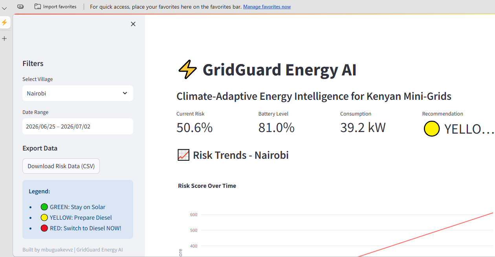
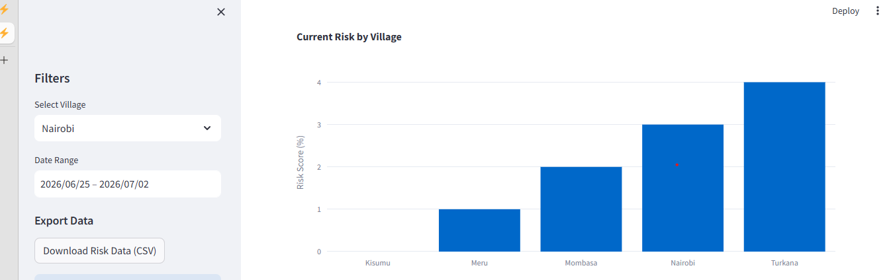

# ⚡ GridGuard Energy AI
**Climate-Adaptive Energy Intelligence for Kenyan Mini-Grids**

---

## 📸 Dashboard Previews

### Main Dashboard - Nairobi

*Real-time risk monitoring showing YELLOW alert (Prepare Diesel)*

### Village Comparison View

*Comparing risk scores across different villages*

---

## 🎯 What This Project Does

GridGuard helps rural Kenyan mini-grid operators predict when to switch from solar+battery to diesel backup based on 7-day weather forecasts, saving up to **30% on fuel costs**.

---

## 🏗️ Architecture

---

## 📊 Key Features

- **Real-time Weather Data** - 7-day forecasts from Open-Meteo API
- **IoT Energy Simulation** - Simulated consumption patterns for 5 villages
- **Risk Scoring Engine** - Calculates risk of power shortage (0-100%)
- **Interactive Dashboard** - Visualize risks with charts and maps
- **API Endpoints** - Access risk data programmatically

---

## 🛠️ Tech Stack

| Component | Technology |
|-----------|------------|
| **Orchestration** | PowerShell |
| **Processing** | Python (Pandas, Polars) |
| **Storage** | Parquet + DuckDB |
| **API** | FastAPI |
| **Dashboard** | Streamlit + Plotly |
| **Data Sources** | Open-Meteo API |

---

## 🚀 Quick Start

```powershell
# Clone the repository
git clone https://github.com/mbuguakevvz/gridguard-energy-ai.git

# Set up virtual environment
python -m venv venv
.\venv\Scripts\Activate.ps1
pip install -r requirements.txt

# Run the pipeline
.\scripts\01_run_pipeline.ps1

# Launch dashboard
streamlit run src/dashboard/app_simple.pygridguard-energy-ai/
├── data/
│   ├── raw/          # Weather and IoT data (Parquet)
│   ├── processed/    # Risk scores (Parquet)
│   └── villages.json # Kenyan village locations
├── src/
│   ├── ingestion/    # Weather and IoT ingestion
│   ├── processing/   # Risk engine
│   ├── dashboard/    # Streamlit dashboard
│   └── api/          # FastAPI endpoints
├── reports/          # Generated CSV reports
├── scripts/          # PowerShell orchestrators
├── .env              # Environment variables
└── requirements.txt  # Python dependencies